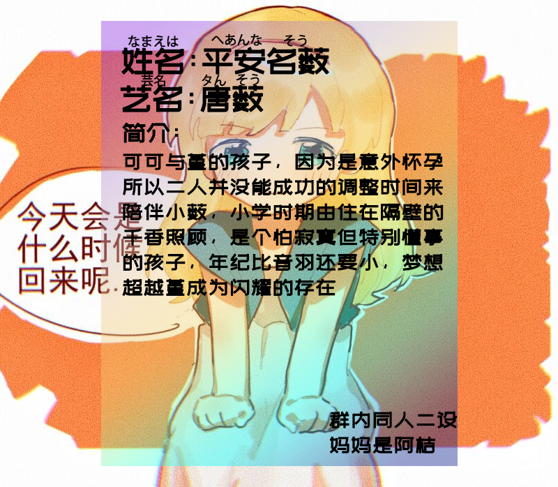

# 这是测试页面

虽然这是测试页面，但这确实是我们最最珍视的孩子们 (认真脸)

1. 千穗理 (Chihori): <ruby>涩谷<rt>しぶや</rt></ruby> ちほり
2. 香菜子 (Kanako): <ruby>涩谷<rt>しぶや</rt></ruby> かなこ
3. 音羽 (Otoha): <ruby>涩谷<rt>しぶや</rt></ruby> おとは
* 薮 (Sou): <ruby>平安名<rt>へあんな</rt></ruby> そう

## Text

[Liella!](https://zh.moegirl.org.cn/Liella!)（读作`リエラ`）是[结丘女子高等学校](https://zh.moegirl.org.cn/结丘女子高等学校)的五位学生组成的学园偶像团体。其团名[Liella!](https://zh.moegirl.org.cn/Liella!)由法语的*lier*（**连结**）与来自意大利语的音乐术语*brillante*（**内心闪耀的**）组合而成，寓意“现在还是很小的星星，但如果将内心的闪耀相连，就一定可以成为***Superstar***”。

值得一提的是，这次[Liella!](https://zh.moegirl.org.cn/Liella!)的角色以及环境设定与以往的9+人团队都有所不同，<span class="hidiv">~~可能是借鉴了[隔壁企划](https://zh.moegirl.org.cn/BanG_Dream!)的成功经验而定下的~~</span>五位学园偶像**都是**结丘女子高等学校的*一年级生*。

除此之外，这次甄选有实际依照声优的定位选择。[*小百合*](https://zh.moegirl.org.cn/伊达小百合)和[*香音*](https://zh.moegirl.org.cn/涩谷香音)皆为**歌唱担当**；[*Liyuu*](https://zh.moegirl.org.cn/Liyuu)是**名副其实的中国人**；[*千砂都*](https://zh.moegirl.org.cn/岚千砂都)和[*恋*](https://zh.moegirl.org.cn/叶月恋)以及声优是团内**领舞**；[*Payton*](https://zh.moegirl.org.cn/Payton尚未)是五位里面**最资深**的成员。

> ~~十集拿下樱花妹因为我是中国铝铜！~~
[*Liyuu*](https://zh.moegirl.org.cn/Liyuu): 不是我说的。

## Image & Table

<!---->



| Key | Value |
| --: | :---- |
| 姓名 | 平安名 薮 |
| 日文名 | <ruby>平安名<rt>へあんな</rt></ruby> そう |
| 罗马字 | Heanna Sou |
| 妇母 | 平安名 すみれ , 唐 可可 |
| 别号 | (艺名) 唐 薮 |
| **学校** | ~~*结丘女子高等学校*~~ |
| **年级** | ~~*一年级*~~ |
| **生日** | ~~*9月28日*~~ |
| 发色 | 金发 |
| **瞳色** | ~~*绿瞳？蓝瞳？*~~ |
| **身高** | ~~*161cm*~~ |
| **血型** | ~~*AB型*~~ |
| **星座** | ~~*天秤座*~~ |
| **兴趣** | ~~*读书、音乐鉴赏、占卜*~~ |
| **喜欢的食物** | ~~*生蛋拌饭、绿茶、蜜瓜*~~ |
| **所属** | ~~*Liella!*~~ |
| 人物形象设计 | 阿桔 |

## [Lyrics](https://zh.moegirl.org.cn/Day1) in 3 Different Display

1. Line-numbered Code Block
    ```text KEN THE 390 (feat. 平安名すみれ) https://zh.moegirl.org.cn/Day1 Day1
    閉まったままのアンサーを解き放つよ今日
    ここから世界中へ　大きい夢
    一緒に叶えに行こう　手を繋いで　あの角の向こう
    いつも通りの景色　変えるレシピ　見つけられたよ
    ...
    繰り返しのルーティンに色をつけるミュージック
    僕らだけがわかる合図　合わせていくチューニング
    唯一無二　それぞれ　代わりなんていない
    代わり映えしない　今　変えてきたい
    ```

2. `<pre>` Text Block
        閉まったままのアンサーを解き放つよ今日
        ここから世界中へ　大きい夢
        一緒に叶えに行こう　手を繋いで　あの角の向こう
        いつも通りの景色　変えるレシピ　見つけられたよ
        ...
        繰り返しのルーティンに色をつけるミュージック
        僕らだけがわかる合図　合わせていくチューニング
        唯一無二　それぞれ　代わりなんていない
        代わり映えしない　今　変えてきたい

3. Blockquote
    
    閉まったままのアンサーを解き放つよ今日
    ここから世界中へ　大きい夢
    一緒に叶えに行こう　手を繋いで　あの角の向こう
    いつも通りの景色　変えるレシピ　見つけられたよ
    ...
    繰り返しのルーティンに色をつけるミュージック
    僕らだけがわかる合図　合わせていくチューニング
    唯一無二　それぞれ　代わりなんていない
    代わり映えしない　今　変えてきたい
    

## Testing Code Block with Syntax Highlighting

```js 測試脚本噠！ https://liella-gen2.github.io/ 主頁傳送門
const http = require("http");
const hostname = "127.0.0.1";
const port = 1337;
http.createServer((req, res) => {
  res.writeHead(200, { "Content-Type": "text/plain" });
  res.end("できっこないよって思ってたことも 踏みだせばほら叶うんだ\n");
}).listen(port, hostname, () => {
  console.log(`At http://${hostname}:${port}/ 今、始まるよSymphony`);
});
(() => {
    const liella = require("Liella");
    liella.restart("Generation II!");
    })();
```
